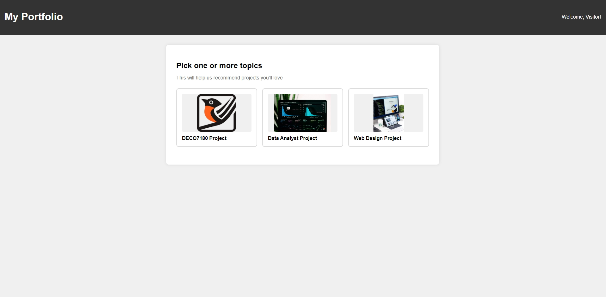
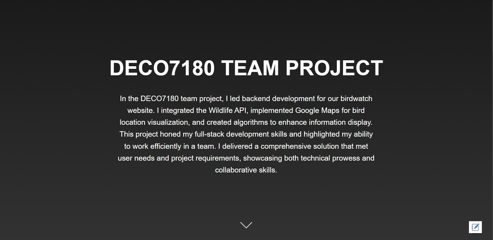
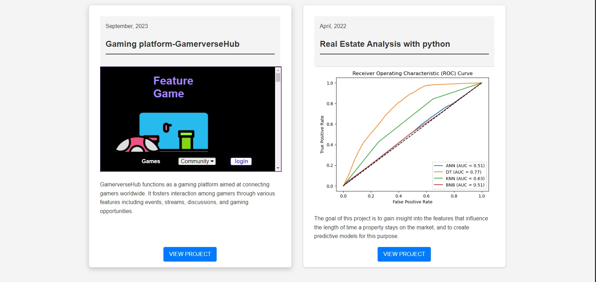
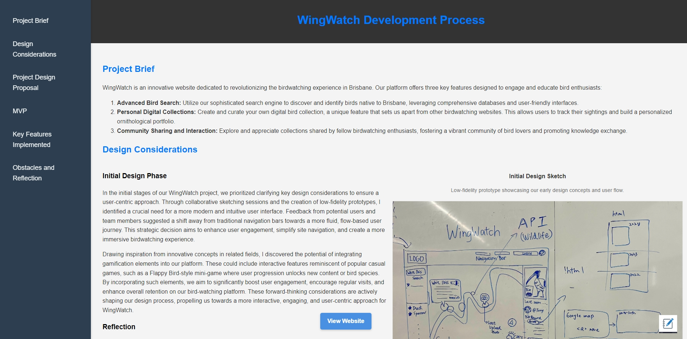

# DECO7180-INDIVIDUAL_PORTFOLIO

Welcome to my portfolio for DECO7180! This repository showcases my skills, projects, and learning journey.

## Table of Contents

1. [Introduction](#introduction)
2. [Files](#files)
3. [Screenshots](#screenshots)
4. [Tools/Technologies Used](#toolstechnologies-used)
5. [How to Use](#how-to-use)
6. [For the Future](#for-the-future)

## Introduction

This portfolio demonstrates the skills and knowledge I've acquired during DECO7180. It features a dynamic landing page that tailors content based on the visitor's purpose, a personalized homepage, and a comprehensive documentation of my DECO7180 project development process.

## Files

- `index.html`: The main landing page
- `landing_page.html`: Secondary landing page (possibly for user purpose selection)
- `wingwatch_process.html`: Page detailing the WingWatch project process
- `README.md`: This file, containing project documentation
- `design_thinking.docx`: Document detailing design thinking process
- CSS files:
  - `landing.css`: Styles for the landing page
  - `style.css`: General styles for the portfolio
  - `wingwatch_process.css`: Styles for the WingWatch process page
  - `write_note.css`: Styles for note-writing functionality
- JavaScript files:
  - `dynamic_headings.js`: Script for dynamic heading behavior
  - `flipper.js`: Script for flip animations
  - `landing.js`: Script for landing page functionality
  - `navigation.js`: Script for navigation elements
  - `note.js`: Script for note-taking functionality
  - `project_display.js`: Script for project display features
  - `smooth_scroll.js`: Script for smooth scrolling behavior
- Directories:
  - `pictures/`: Directory for image assets
  - `.vscode/`: VS Code configuration files
  - `.gitattributes`: Git attributes file

## Screenshots

(Include screenshots of key pages/features here. For example:)

1. Landing Page
   

2. Homepage
   
   

3. DECO7180 Project Portfolio
   

## Tools/Technologies Used (doesn't include tools used in other projects other than DECO7180)
- HTML5
- CSS
- JavaScript
- Git for version control
- Figma for design prototyping

## How to Use
Simply paste the url into your browser to view the portfolio.
### for deco7180 tutors
https://deco1800-7b07e43d.uqcloud.net/DECO7180-INDIVIDUAL_PORTFOLIO/landing_page.html
### for everyone else 
https://jessechen543.github.io/DECO7180-INDIVIDUAL_PORTFOLIO/landing_page.html

## For the Future
- Add more interactive elements to project showcases
- build a server for sending notes to the user's email or suggestions to the my email
- Develop an about me section to let people know more about me
- Optimize for mobile devices and improve accessibility

## References

[1] "How TO - Sticky/Affix Header," W3Schools. [Online]. Available: https://www.w3schools.com/howto/howto_js_sticky_header.asp. [Accessed: (insert access date here)].

[2] "How TO - Flip Card," W3Schools. [Online]. Available: https://www.w3schools.com/howto/howto_css_flip_card.asp. [Accessed: (insert access date here)].

[3] C. Coyier, "Sticky, Smooth, Active Nav," CSS-Tricks, Jun. 25, 2019. [Online]. Available: https://css-tricks.com/sticky-smooth-active-nav/. [Accessed: (insert access date here)].

[4] C. Coyier, "Smooth Scrolling," CSS-Tricks, Apr. 13, 2016. [Online]. Available: https://css-tricks.com/snippets/jquery/smooth-scrolling/. [Accessed: (insert access date here)].

[5] "Create a Sticky Notes App with HTML CSS & JavaScript," YouTube, Jun. 10, 2021. [Online]. Available: https://www.youtube.com/watch?v=r4RQ38EoLds. [Accessed: (insert access date here)].

[6] "What is the correct way to write HTML using JavaScript?," Stack Overflow. [Online]. Available: https://stackoverflow.com/questions/1533568/what-is-the-correct-way-to-write-html-using-javascript. [Accessed: (insert access date here)].

[7] OpenAI, "ChatGPT (version 3.5)," 2023. [Online]. Available: https://www.openai.com/chatgpt. [Accessed: (insert access date here)].

[8] R. S. Uraon, A. Chauhan, R. Bharati, and K. Sahu, "Do agile work practices impact team performance through project commitment? Evidence from the information technology industry," International Journal of Productivity and Performance Management, vol. 73, no. 4, pp. 1212-1234, 2024. [Online]. Available: https://doi.org/10.1108/IJPPM-03-2023-0114

[9] D. Dicheva, C. Dichev, G. Agre, and G. Angelova, "Gamification in Education: A Systematic Mapping Study," Educational Technology & Society, vol. 18, no. 3, pp. 75-88, 2015. [Online]. Available: https://www.jstor.org/stable/jeductechsoci.18.3.75

Note: ChatGPT (reference [7]) was used to generate comments and fixing grammar.

---
